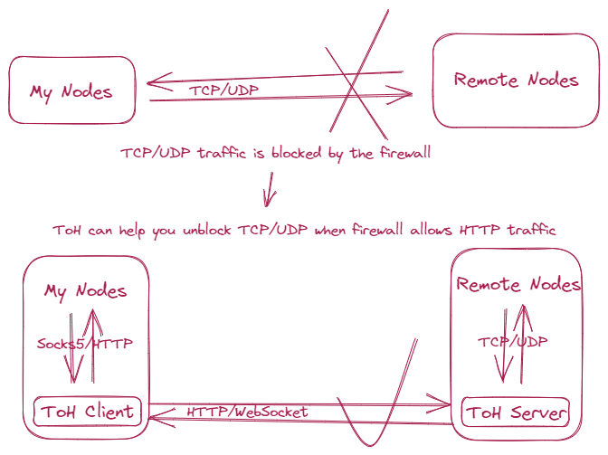

# Introduction
`ToH` is TCP/UDP over HTTP/WebSocket. In short, proxy your network over WebSocket

## Table of contents
- [ToH server](#toh-server)
- [Caddy or Nginx wrap ToH server with TLS](#caddy-or-nginx-wrap-toh-server-with-tls)
- [Port-forward tool `pf` act as ToH client](#port-forward-tool-pf-act-as-toh-client)
- [Socks5+http proxy server `s5` act as ToH client](#socks5http-proxy-server-s5-act-as-toh-client)
- [Android project `tohdroid` act as ToH client](#android-project-tohdroid-act-as-toh-client)

### ToH server
- Build
```sh
$ git clone https://github.com/rkonfj/toh.git
$ make linux
```

- Run
```sh
$ ./toh serve
time="2023-04-26T21:49:33+08:00" level=info msg="initializing acl file acl.json"
{
    "keys": [
        {
            "name": "default",
            "key": "5CCQAoN905PdIejsal55Am3z2mXY6ueLrtdSA8OCpVc"
        }
    ]
}
time="2023-04-26T21:49:33+08:00" level=info msg="acl: load 1 keys"
time="2023-04-26T21:49:33+08:00" level=info msg="server listen on 127.0.0.1:9986 now"
```
> the `key` here will using by `pf` and `s5` commands

### Caddy or Nginx wrap ToH server with TLS
- Caddy
```sh
$ caddy reverse-proxy --from https://fill-in-your-server-here.toh.sh --to localhost:9986
```

- Nginx
```
server {
	listen 443 ssl;
	server_name fill-in-your-server-here.toh.sh;

	ssl_certificate     tls.crt;
	ssl_certificate_key tls.key;

	location /ws {
		proxy_pass http://localhost:9986;
		proxy_set_header Host $host;
		proxy_set_header X-Real-IP $remote_addr;
		proxy_set_header X-Forwarded-For $proxy_add_x_forwarded_for;
		proxy_http_version 1.1;
		proxy_set_header Upgrade $http_upgrade;
		proxy_set_header Connection upgrade;
	}
}
```
### Port forward tool `pf` act as ToH client
- SSH over HTTP
```
$ # get a chatgpt robot
$ ssh -o ProxyCommand="./toh pf -s https://fill-in-your-server-here.toh.sh/ws -k 5CCQAoN905PdIejsal55Am3z2mXY6ueLrtdSA8OCpVc -f tcp/%h:%p" chat@127.0.0.1
```
- Common use case
```sh
$ ./toh pf -s https://fill-in-your-server-here.toh.sh/ws -k 5CCQAoN905PdIejsal55Am3z2mXY6ueLrtdSA8OCpVc -f udp/127.0.0.53:53/8.8.8.8:53 -f tcp/0.0.0.0:1080/google.com:80
time="2023-04-28T13:52:31+08:00" level=info msg="listen on 127.0.0.53:53 for udp://8.8.8.8:53 now"
time="2023-04-28T13:52:31+08:00" level=info msg="listen on 0.0.0.0:1080 for tcp://google.com:80 now"

$ # run in another shell
$ dig @127.0.0.53 www.google.com +short
142.250.68.4

$ curl 127.0.0.1:8080
<HTML><HEAD><meta http-equiv="content-type" content="text/html;charset=utf-8">
<TITLE>301 Moved</TITLE></HEAD><BODY>
<H1>301 Moved</H1>
The document has moved
<A HREF="http://www.google.com:8080/">here</A>.
</BODY></HTML>
```

### Socks5+http proxy server `s5` act as ToH client
```sh
$ ./toh s5
time="2023-05-12T15:02:11Z" level=info msg="initializing config file /root/.config/toh/socks5.yml"
listen: localhost:2080
servers:
  - name: us1
    api: https://fill-in-your-server-here.toh.sh/ws
    key: 5CCQAoN905PdIejsal55Am3z2mXY6ueLrtdSA8OCpVc
    ruleset:
      - https://raw.githubusercontent.com/rkonfj/toh/main/ruleset.txt
time="2023-05-12T15:02:11Z" level=info msg="downloading https://raw.githubusercontent.com/rkonfj/toh/main/ruleset.txt"
time="2023-05-12T15:02:14Z" level=info msg="ruleset   us1: special 0, direct 0, wildcard 21"
time="2023-05-12T15:02:14Z" level=info msg="total loaded 1 proxy servers and 0 groups"
time="2023-05-12T15:02:14Z" level=info msg="downloading /root/.config/toh/country.mmdb (this can take up to 5m0s)"
time="2023-05-12T15:05:17Z" level=info msg="listen on localhost:2080 for socks5 now"

$ # run in another shell
$ https_proxy=socks5://127.0.0.1:2080 curl https://api64.ipify.org
104.207.152.45
$ # wow, great! the `104.207.152.45` is your proxy ip
```
- full configuration can be viewed [here](https://github.com/rkonfj/toh/blob/main/cmd/s5/server/config.go)  
- socks5 support `CONNECT` and `UDP ASSOCIATE`
- the server `us1` is the test server, will stopped in the future

### Android project `tohdroid` act as ToH client
see project [tohdroid](https://github.com/rkonfj/tohdroid) for details
